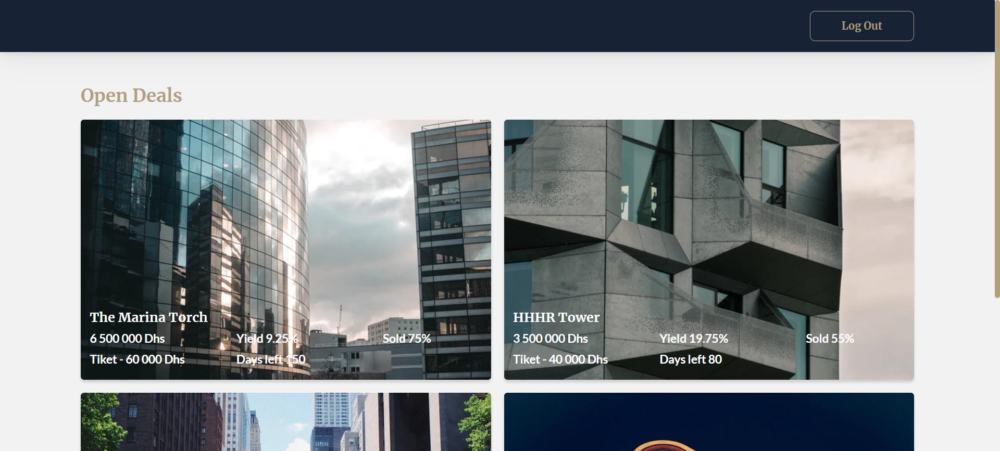
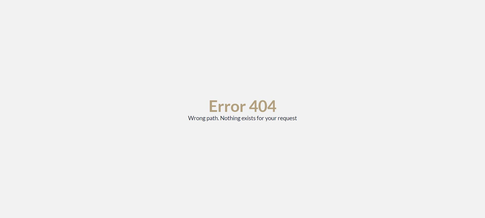

# Zenbit Application

## Link to backend repository
https://github.com/M-Farmaha/zb-backend

## Link to the deployed frontend with gh-pages
https://m-farmaha.github.io/zb-frontend/

Welcome to Zenbit Application Backend repository!

## Pages
- Start page

- Auth page (register/login)

- Main page

- Error page (for any non-existent route)

This is a repository that uses the following technologies:

#### Frontend:

 - **react**
- **react router dom**
- **redux / RTK query**
- **styled components**
- **responsive markup**

#### Backend:

- **node.js**
- **express**
- **mongoBD / mongoose**

## How to Contribute

If you wish to make your own fixes or improvements, you should:

1. Clone the repository to your computer.
2. Make changes and additions to the source code.
3. Test to ensure everything works correctly.
4. Submit a pull request with your changes.

## Author

The "Zenbit Application" is developed by M-Farmaha in 2023.

## License

This project is distributed under the MIT License.

## Recommended Browser

We recommend using Google Chrome for the best experience when using our app.
